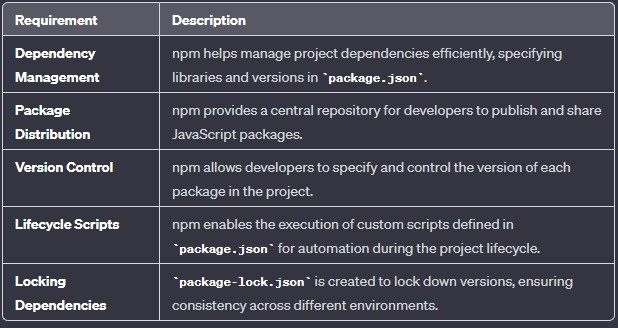
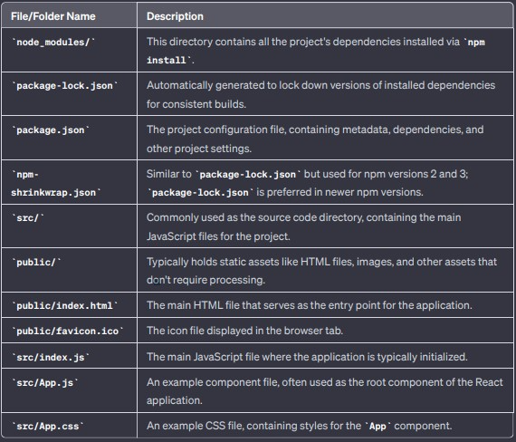

## React !

React.js is a JavaScript library for building user interfaces, and it relies on a set of dependencies and tools to manage the development and deployment processes. npm is often used in React.js projects to handle these dependencies, scripts, and other project-related configurations.

 ## npm
 npm is used for managing and sharing packages or modules of JavaScript code, making it easier for developers to reuse code and manage dependencies in their projects. It simplifies the process of installing, updating, and managing external libraries or tools that your project may depends on.  
 When we create a React.js project using tools like Create React App, npm is automatically initialized, and a package.json file is created to manage project dependencies. We use npm commands to install, update, and manage these dependencies throughout the development process.

## What is a bundler?
A bundler is a tool that is used to combine or "bundle" multiple JavaScript and/or CSS files and their dependencies into a single file (or a few files). This process is often referred to as bundling, and the resulting files are known as bundles. The primary goal of a bundler is to optimize the delivery of code to the browser by reducing the number of requests and the total size of the files.

some key aspects and features of bundlers:

   * Module system
   * Dependency Resolution
   * Code Splitting
   * Minification Transpilation
   * HMR (Hot Module Replacement) - It's a development feature that allows dynamic updating of modules in a running application, enabling developers to see code changes instantly without reloading the entire page.
   * Caching - For Faster Build
   * Image optimization
   * Differential bundling- support for older version of browsers
   * Tree Shaking

  some bundlers are : Webpack, Parcel, Rollup, Vite etc. 

 ### Installing a dependency (we are using Parcel here)  
        
          npm install -D parcel

 * it installs the Parcel bundler as a development dependency in the React.js project, with the -D flag indicating that it's for development use only.
* The -D flag ensures that Parcel is listed in the devDependencies section of the package.json file, making it clear that it is intended for development use only.

        "devDependencies":            // major.minor.patch
         "parcel": "^2.11.0"          // ^ (caret) -> "^1.2.3", it means you will accept any version that is 1.x.x but not 2.0.0 or higher.
                                      // ~ (tilde) -> ~1.2.3", it means you will accept any version that is 1.2.x but not 1.3.0 or higher.
  }

###  Creating a package.json from scratch by following the commands below:

        npm init       //  only this command and then follow as it says

        package name: lect-2                         // Your_Package_name
        version: 1.0.0                              //  initial_version_of_your_projects(usually 1.0.0)
        description: Basics of React           // A brief description of project, providing its purpose and functionality
        entry point: (index.js) App.js            // let it be App.js for now instead of index.html (can change it later)
        test command: test                      // let it be for now instead of npm run dev(start), can change it later
        git repository: https://github.com/Kamlesh-Negi/Learning_react          // your git repo. address
        keywords: React, npm, JavaScript, jsx       // write Keywords here that describe your project. Help others discover your project on npm
        author: Kamlesh                               //  Your_name(Author)     
        license: (ISC)          // The license under which your project is distributed, by-default ISC here, you can choose other

*   we can recreate our node_modules using pacakge.json and package-lock.json so we don't need to push it over git            

### .gitignore

All the files which we don't want to push on git their name will be written here

        /node_modules

## rendering the app(building the app using parcel)

        npx parcel index.html           // executed the parcel

        //npx -> npx is a package runner tool that comes with npm and is used to execute packages directly. In this case, it's running the Parcel bundler on the specified HTML file
    

now , instead of using *cdn link* we will install react and react-dom in our node modules:

        npm install react
        npm install react-dom

## Why Import?
React follows a component-based architecture, where different parts of the UI are encapsulated into reusable components. The import statements allow you to use React's features and functionality within your application.  
Simply installing react and react-dom won't run your app, you need to import them in your app (App.js) first:

                import React from "react"        
                import ReactDOM from "react-dom/client"
               

Still it won't make your app work. Why?  
Because our Browser scripts cannot have imports and exports, i.e. browser is taking our App.js file inside script as a normal script but normal JavaScript don't have imports and exports we need to tell the browser that it is a module instead of normal javascript file.  
So to solve this problem we need to provide type = "module" in script tag because, with the ES6 module system, files are treated as modules, and the import and export syntax is used.
                
                

running your app

                npx parcel index.html

make sure you remove the main(entry-point)[we have set it to App.js] from the package.json to build your app in production

                npx parcel build index.html

### configuring for browsers version

 in package.json
 
        "browserlist": ["last 2 version",               // will support last two version of most of the browsers
                        "cover 99.5% in IN"             // specifically telling the coverage for a country
                        ]

### creating script in package.json
we can create scripts in package.json for building our project in development or production mode instead of writing the *npx parcel index.html* again and again

create a script:

        "scripts": {
                 "build":"parcel build index.html",     
                 "start": "parcel index.html",
                 "test": "test"
                 },
        
        
// for development  ->  npm run build  
// for production  ->  npm run start

