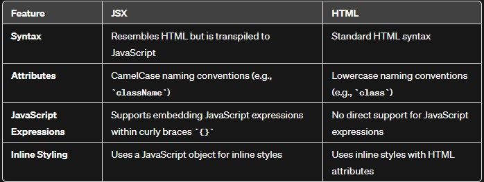
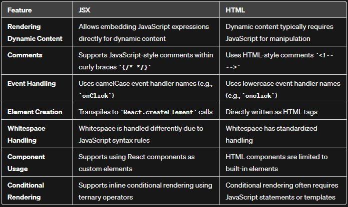
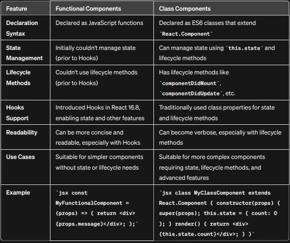

## React Elements??

React elements are the fundamental building blocks of React applications.

An element in React is a plain JavaScript object that describes what should appear in terms of DOM nodes.
Unlike browser DOM elements, React elements are lightweight and inexpensive to create.
#### Creating React Elements:
You can create a React element using JSX (JavaScript XML) or directly using React without JSX.  
Here’s an example of creating a simple React element using JSX:
 ```
const element = <h1>Hello, world</h1>;
```

In this case, ```<h1>``` represents the type of element we want (in this case, a heading), and "Hello, world" is the content of the element.
#### Rendering Elements:
To render a React element into the DOM, we need a container (usually a ```<div>``` with an id).
For instance, if we have an HTML file with a ```<div id="root"></div>```, we can render our element into it:

```
ReactDOM.render(element, document.getElementById('root'));

```

#### Adding Properties and Styling:
You can apply properties (such as className) to React elements.
For example, to add a CSS class to our element:
```
const element = <h1 className="testClass">Hi ...</h1>;
```

Elements can be as simple as a single tag or can contain nested elements.
#### Creating Elements Without JSX:
JSX is not mandatory for using React. You can create elements directly using React.createElement.  
For instance:
```
const element = React.createElement("h1", null, "Hello World");
```

The first argument specifies the element type, the second argument represents properties, and the third argument is for child elements.
#### Example with Nested Elements:
Here’s an element containing a ```<div>``` with an ```<h1>``` and an ```<h2>```:
```
const element = (
  <div>
    <h1>Welcome to React Programming World</h1>
    <h2>Understanding React Rendering...</h2>
  </div>
);
```

This element can be rendered into the DOM just like before, i.e., 

```
ReactDOM.render(element, document.getElementById("root"))
```

* Difference between React element and DOM element:


### JSX vs HTML
JSX has a syntax that resembles HTML, but it is not HTML. JSX is a syntactic sugar for React.createElement calls. In JSX, you write components and elements using a syntax similar to HTML, but it gets transpiled to JavaScript.



#### Creating an element using React
```
const heading = React.createElement("h1",{},"Heading 1 using React")
```

#### Creating an element using JSX  
``` 
const heading = <h1>Heading 1 using JSX</h1>
```

If we are writing multiple lines then we should wrap it into parantheses()
```
const heading = (<h1 className = "head">
Heading having classname
</h1>)
```
However, the absence of parentheses doesn't cause an issue. However, but applyin them improves readability.


*Note : JSX code is transpiled to React.createElement calls and then it is converted it to a JS(JavaScript) Object (DOM) and then it is rendered as HTML element*

## Components
In React, components are the building blocks of a user interface. A React component is a resuable, self-contained piece of UI that can be composed to create more complex UIs. Components can be thought of as custom HTML elements that you create to encapsulate and manage a specific piece of functionality or UI.

 We have two main types of components: 
 1. Class components  (older way)
 2. Functional components (latest practice)

 

#### Different ways of creating functional component :
1. With the help of *Arrow function*
```
const MyComponent = () => {
  return <p> Using arrow function </p> 
}
```
2. Using a normal *function* keyword
```
const MyComponent = function(){
  return (
    <p> Using function keyword </p>
  )
}
```

NOTE: In JavaScript we can assign a function to a variable

#### Different ways to return from a functional component :
1.  Without parantheses- if you are returning a single line expression, you can omit curly braces
```
const MyComponent = () => <h1>Returning without curly braces</h1>  
```
This is equivalent to :
```
const MyComponent = () => {
  return <h1>Returning with curly braces</h1>
}
 ```
 2. With Parantheses: If your component return statement includes multi-line expression, you should use parantheses()
```
const MyComponent = () => (
  <div>
  <h1>Hello World!</h1>
  <p>This is a Multi-line Expression</p>
  </div>
)
```
3. Returning an object within parantheses
```
const MyComponent = () =>({
  type: "div",
  props: {children: "Hello World"},
})
```

NOTE: In JSX, all elements must be wrapped in a single parent container. This is a fundamental rule in JSX syntax. The reason behind this requirement is that when JSX is transpiled into JavaScript, it is transformed into a single expression. A single expression can only have one top-level element.

```const MyComponent = () => {
  return (
    <div>
      <h1>Hello</h1>
      <p>This is a paragraph.</p>
    </div>
  );
};
```

In case, if you don't want an extra container than you can just use fragments <> </>
```const MyComponent = () => {
  return (
    <>
      <h1>Hello</h1>
      <p>This is a paragraph.</p>
    </>
  );
};
```

### Rendering a  functional Component

Rendering a react functional component is slightly different from rendering a react element
```
const root = ReacDOM.createRoot(document.getElementById("root"))
root.render(heading)        // for an element
root.render(<MyComponent/>)   // for a functional component
``` 
 
* We can render one component inside another component(also known as Component composition):
```
const ComponentOne = () => <h1>Hi! Component One</h1>

const ComponentTwo = () => (
                            <div id="container">
                            <h1>Hi! Component Two</h1>
                            <ComponenetOne>
                            </div>
                          )  

```

### Writing a JavaScript code/expression inside JSX
  Using {} we can write javaScript inside it
```
  const number = 1000
  const MyComponent = () => (
    {number}
    <div id= "container">
    <h1>javaScript expression {256+44} </h1>
    </div>
  )
  ```
  ### Escaping, Sanitizing, Cross-site Scripting(XSS)
  Suppose we are getting some data from an API which we are using in our jsx and some attacker inject some malicious code to get access to our browser/system then whatever we write inside {}, the JSX won't run it blindly, it sanitizes the data and then pass it to execute

  When you interpolate data into JSX using curly braces {}, React escapes the content by default. This means that any potentially harmful characters are converted to their HTML entity equivalents, preventing them from being treated as raw HTML or script code.

## Cross-Site Scripting (XSS)
  **Cross-Site Scripting (XSS)** is a web security vulnerability that allows attackers to inject malicious scripts into web pages viewed by other users. The goal of XSS attacks is typically to steal sensitive information, manipulate the appearance of a web page, or perform actions on behalf of the victim user. There are different types of XSS attacks, but they generally involve injecting and executing unauthorized scripts in the context of a user's browser.

#### Types of XSS Attacks:

1. **Stored (Persistent) XSS:** Malicious scripts are permanently stored on a server and served to users when they access a particular page or resource.

2. **Reflected (Non-Persistent) XSS:** Malicious scripts are embedded in a URL or input field, and the server reflects the script back to the user's browser.
#### Injection Points:

XSS vulnerabilities often arise when user input is not properly validated or sanitized before being included in HTML content.

#### Ways to prevent from Cross-Site Scripting (XSS)

#### 1. Escaping:

**HTML Entity Encoding:** To prevent XSS, user input should be properly escaped or HTML entity-encoded. This involves converting special characters to their HTML entity equivalents. For example, < becomes ```&lt;``` and > becomes ```&gt;```.
React automatically escapes data by default when it is rendered within curly braces {} in JSX. This behavior helps mitigate XSS vulnerabilities in React applications.

#### 2.  Sanitizing:

*DOMPurify :* A popular library for sanitizing HTML content in JavaScript. It helps prevent XSS attacks by removing potentially dangerous elements and attributes from user-generated HTML.
Server-Side Sanitization: Ensure that user input is properly validated, sanitized, and encoded on the server side before rendering it in HTML. This helps protect against stored XSS attacks where malicious input is stored on the server.

#### 3. Content Security Policy (CSP):

Implementing a Content Security Policy is an additional layer of defense against XSS. CSP allows you to define a set of rules to control which resources can be loaded on a web page, reducing the risk of executing malicious scripts.


