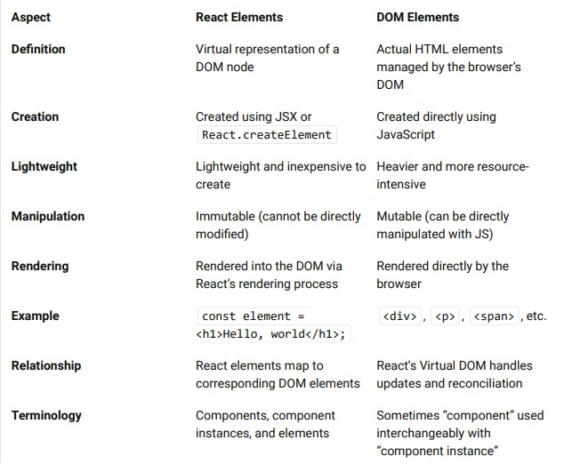
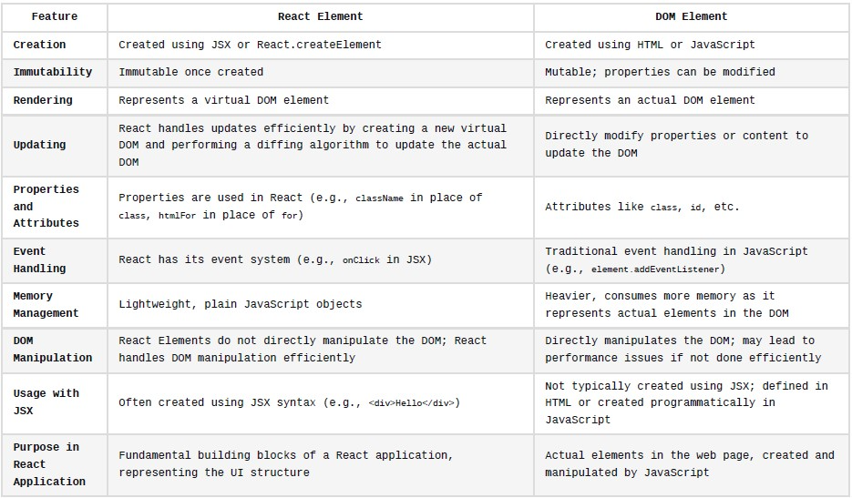

## React Elements??

React elements are the fundamental building blocks of React applications.

An element in React is a plain JavaScript object that describes what should appear in terms of DOM nodes.
Unlike browser DOM elements, React elements are lightweight and inexpensive to create.
#### Creating React Elements:
You can create a React element using JSX (JavaScript XML) or directly using React without JSX.  
Here’s an example of creating a simple React element using JSX:
 ```
const element = <h1>Hello, world</h1>;
```

In this case, ```<h1>``` represents the type of element we want (in this case, a heading), and "Hello, world" is the content of the element.
#### Rendering Elements:
To render a React element into the DOM, we need a container (usually a ```<div>``` with an id).
For instance, if we have an HTML file with a ```<div id="root"></div>```, we can render our element into it:

```
ReactDOM.render(element, document.getElementById('root'));

```

#### Adding Properties and Styling:
You can apply properties (such as className) to React elements.
For example, to add a CSS class to our element:
```
const element = <h1 className="testClass">Hi ...</h1>;
```

Elements can be as simple as a single tag or can contain nested elements.
#### Creating Elements Without JSX:
JSX is not mandatory for using React. You can create elements directly using React.createElement.  
For instance:
```
const element = React.createElement("h1", null, "Hello World");
```

The first argument specifies the element type, the second argument represents properties, and the third argument is for child elements.
#### Example with Nested Elements:
Here’s an element containing a ```<div>``` with an ```<h1>``` and an ```<h2>```:
```
const element = (
  <div>
    <h1>Welcome to React Programming World</h1>
    <h2>Understanding React Rendering...</h2>
  </div>
);
```

This element can be rendered into the DOM just like before, i.e., 

```
ReactDOM.render(element, document.getElementById("root"))
```

* Difference between React element and DOM element:

