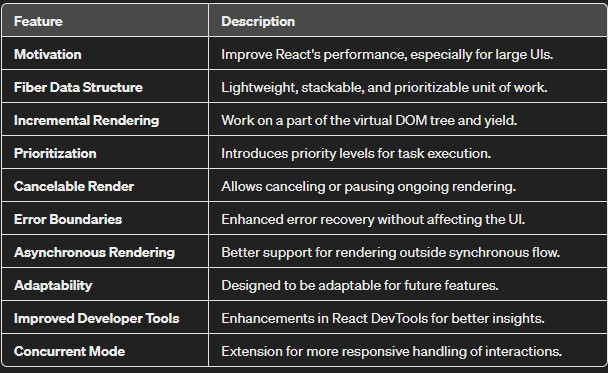
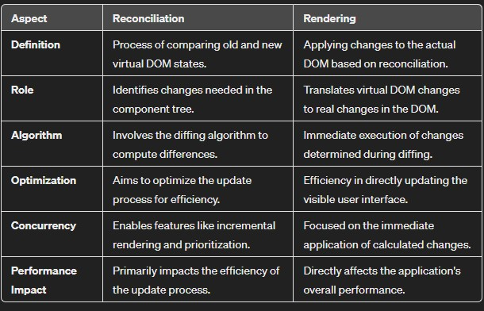
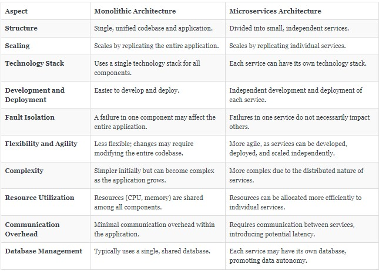

# Props
**Props stands for properties.**  
* Props are arguments passed into React components.

* They are like function arguments in JavaScript and attributes in HTML.

* You can think of them as a way to send data into a component.


### Passing Props:
*Syntax:* To send props into a component, use the same syntax as HTML attributes.  
Example: Let’s say we have a Car component. We can add a “brand” attribute to it like this:
```
const myElement = <Car brand="Ford" />;
```
The Car component then receives the argument as a props object:
```
function Car(props) {
  return <h2>I am a {props.brand}!</h2>;
}
```

### Data Flow:
* ***Unidirectional:*** Data with props flows from parent to child components.  
* ***Consistent Interfaces:*** Props allow you to create consistent interfaces across the component hierarchy.  
* ***Passing Different Types of Data:***
If you have a variable to send (not just a string), enclose the variable name in curly brackets:
```
const carName = "Ford";
return (
  <>
    <h1>Who lives in my garage?</h1>
    <Car brand={carName} />
  </>
);
```

You can also pass an object:
```
const carInfo = { name: "Ford", model: "Mustang" };
return (
  <>
    <h1>Who lives in my garage?</h1>
    <Car brand={carInfo} />
  </>
);
```

* We can also pass props using *destructuring*.    
* Destructuring can be particularly useful when a component receives multiple props, as it allows you to explicitly specify which values you want to use.


***## Note:*** React props are read-only! Attempting to change their value will result in an error.

So, when you have to dynamically passing some data to a component you pass it as a prop

## Folder Structure of the Project

We should keep our project files in an organised way so that it is easy for a new developer to understand the project easily.  
It is not mandatory to keep separate folders and files but a good practice to have these. Some recommended practice are as follow:

  * We should keep our source files in ``src`` folder
  * we should keep our components in ``components`` folder under *src*
  * we should keep our hard coded data like some cdn links, Logo urls, API endpoints, configuration settings, etc in ``constants`` folder.  
    *  We can use some other folder name also like ``utils``, ``data``, ``common``, etc. instead of ``constants``
  * Make sure your components file name should start with a uppercase. For example ```MyComponent.js```
  * Make sure your hard-coded data file's name should start with a lowercase

### export and import
``export`` and ``import`` are used to link these components and data files together to make the app work.
* First export the component then import it in the file where it is used.

Syntax for exporting a file/component:
```
export default component_name;
```

Syntax for importing a file/component:
```
import {component_name} from "path_to_the_component";
```

NOTE: There can only be one default in each component/data file.  

So, to export multiple variables/functions from a single file, i.e., for named exports:
```
export {variable1, variable2, variable3}
 ```
similarily for importing these:
```
import {variable1, variable2, variable3} from "path_to_these_files"
 ```

example:
```
const cdn_URL = "some_CDN_URL_here"
const LOGO_URL = "some_LOGO_URL_here"

const MyComponent = () => {
  return (
    <div>
      <h1>Hello</h1>
      <p>This is a paragraph.</p>
    </div>
  );
};

export {cdn_URL, LOGO_URL, MyComponent}
```
```
import {cdn_URL, LOGO_URL, MyComponent}

const MyComponent2 = () = {
  return (
    <>
    <div> 
    
    <MyComponent />
  )
}
export default MycComponent2;
```

## Hooks
In React, hooks are functions that allow you to use state and other React features in functional components.
* They were introduced in React 16.8 to enable functional components to manage local component state and perform side effects
* Some hooks are:
  * **useState**: Allows functional components to manage state. It returns an array with two elements: the current state value and a function that lets you update it.
  ```
  const [count,setCount] = useState(0)
  ```
**** some other ways of using/declaring useState
  ```
  1. Destructuring in the Declaration:
       const arr = useState(resList)
       const [listOfRestaurant, setListOfRestaurant] = arr
   
   
  2. Accessing Elements via Index:
      const arr = useState(resList)
      const listOfRestaurant = arr[0] 
      const setListOfRestaurant = arr[1] 
   ```

  *Whenever a state variable updates, React will re-render our component.*

  * **useEffect**: Enables performing side effects in functional components, such as data fetching, subscriptions, or manually changing the DOM. It runs after every render.
```
useEffect(() => {
  // Side effect code here
}, [dependencies]);

```
**Note: It is not mandatory to use dependency array in useEffect. But a callback function is mandatory.**

  *  The first argument is a callback fuction that contains the code for the side effect you want to perform.
  * The second argument is an optional array of dependencies. If provided, the effect will only re-run if one of the dependencies has changed.
    * If empty [] dependency, then useEffect is called only once after the initial render.
    
    * If this arguments is omitted(i.e., if we remove[]), the effect will run after every render.


### How React works?
Behind the scene react uses Reconciliation and diffing algorithm to make our app fast

When our state changes, react make a *virtual DOM* which is like a representation of an actual DOM

* Diff Algorithm: This ,also konwn as Reconciliation, is the algorithm which finds out the difference between the old and new virtual DOM and reflect the changes only at the specific parts without actually reloading or re-rendering the actual DOM. This makes our app fast.

* React Fibre: 
 It is an internal reimplementation of the React reconciliation algorithm, introduced in React version 16.

    * It's not a separate version but rather an update to the core algorithm that allows React to perform better and more efficiently handle complex user interfaces.  


  
#### Reconciliation Vs Rendering
* Reconciliation is the process of determining what needs to change in the component tree, while rendering is the subsequent application of those changes to the actual DOM.

* Reconciliation involves the efficient computation of differences, and Rendering is the final step where these differences are reflected visually in the user interface.

* Both processes work together to ensure that the UI accurately represents the current state of the application.




#### Monolith vs Microservices
In **monolith architecture**, the entire application is built as a **single, tightly integrated unit**.

All functionalities (such as **database access, business logic,and user interface**) are covered within a single codebase.


In **microservices architecture**, the application is made up of small, independent services that handle specific fuctionalities.

Each service communicates with others directly using lightweight protocols(e.g., HTTP).


#### Approaches to get data from API

 We can populate our app with the data suing two approaches:
 1. **LOADS PAGE------->Fetch API------->RENDER**
 2. **LOADS PAGE------->RENDER UI------->Fetch API------->RE-RENDER (with new Data)**

 In React, we will be using the second approach because it gives a better User Experience.

#### fetching the data from API

To fetch data from the API we will use a method provided by Browser called ``fetch()``
  ```
  useEffect(() => {
      const fetchData = async () => {
        const response = await fetch('https://api.example.com/data');
        const result = await response.json();
        setData(result);
      };

      fetchData();
    }, []); // Empty dependency array ensures this effect runs once on mount
  ```
  We can also use **fetch().then().then().catch()**

  ```   
  fetch('https://api.example.com/data')
  .then(response => response.json())
  .then(data => console.log(data))
  .catch(error => console.error('Error:', error));
  
  ```

  ### Optional Chaining
  Optional chaining is a feature in JavaScript that allows you to access properties of an object without explicitly checking if each level of the property chain exists. It helps to simplify the code when dealing with nested objects or accessing properties that might be undefined or null.
  * The optional chaining syntax is represented by the `?.` operator. 
  * example:
    ```
      const user = {
          name: 'John',
          address: {
                      street: '123 Main St',
                      city: 'Example City',
                      // no 'zip' property
                   },
          // no 'email' property
        };
      ```
* without optional chaining, if you wanted to access the `zip` property of the user's address, you might do something like:

  ```
      const zipCode = user.address ? user.address.zip : undefined;
  ```
* with optional chaining, the same can be achieved more concisely:
 
  ```
  const zipCode = user?.address?.zip;
   ```

#### *Here are some key points about optional chaining:*

**1. Graceful Handling:** It allows you to handle nested properties more gracefully, avoiding errors when attempting to access properties on null or undefined.

**2. Short-Circuiting:** If any part of the chain is null or undefined, the entire expression short-circuits, and the result is undefined.

**3. Functions:** Optional chaining can also be used with function calls. For example, user?.getName?.() will only call getName if it exists.

### Shimmer UI
A shimmer UI is a visual design techinque used to indicate that cotent is loading or that specific area of a user inteface is in the process of being fetched.
* Instead of showing a static loading spinner or placeholder, a shimmer effect creates the illusion of a subtle animation, typically in the form of a moving gradient or wave, to suggest that data is on it way.
* This techinque is especially prevalent in mobile app develpement and single-page applications.