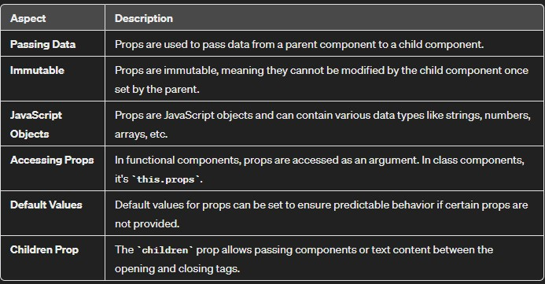

# Props
**Props stands for properties.**  
* Props are arguments passed into React components.

* They are like function arguments in JavaScript and attributes in HTML.

* You can think of them as a way to send data into a component.



### Passing Props:
*Syntax:* To send props into a component, use the same syntax as HTML attributes.  
Example: Let’s say we have a Car component. We can add a “brand” attribute to it like this:
```
const myElement = <Car brand="Ford" />;
```
The Car component then receives the argument as a props object:
```
function Car(props) {
  return <h2>I am a {props.brand}!</h2>;
}
```

### Data Flow:
* ***Unidirectional:*** Data with props flows from parent to child components.  
* ***Consistent Interfaces:*** Props allow you to create consistent interfaces across the component hierarchy.  
* ***Passing Different Types of Data:***
If you have a variable to send (not just a string), enclose the variable name in curly brackets:
```
const carName = "Ford";
return (
  <>
    <h1>Who lives in my garage?</h1>
    <Car brand={carName} />
  </>
);
```

You can also pass an object:
```
const carInfo = { name: "Ford", model: "Mustang" };
return (
  <>
    <h1>Who lives in my garage?</h1>
    <Car brand={carInfo} />
  </>
);
```

* We can also pass props using *destructuring*.    
* Destructuring can be particularly useful when a component receives multiple props, as it allows you to explicitly specify which values you want to use.


***## Note:*** React props are read-only! Attempting to change their value will result in an error.

So, when you have to dynamically passing some data to a component you pass it as a prop